# P2P OS Resource Sharing System

This presentation provides a visual overview of the P2P OS Resource Sharing System, its architecture, and key workflows.

## 1. High-Level Architecture

The system consists of a central **Tracker** and multiple **Peers**. The Tracker is responsible for peer discovery and load balancing, while the Peers are responsible for resource sharing.

---

## 2. CPU Task Execution Flow

The system supports two modes of CPU task execution: **confidential** (local execution) and **non-confidential** (remote execution).

```mermaid
sequenceDiagram
    participant Client as 💻 Client (Peer A)
    participant Tracker as 📡 Tracker
    participant RemotePeer as 💻 Remote Peer (Peer B)
    participant SchedulerA as 🗓️ Peer A's Scheduler
    participant SchedulerB as 🗓️ Peer B's Scheduler

    alt Non-Confidential Task (confidential: false)
        Client->>Tracker: 1. Request best peer for CPU task
        Tracker-->>Client: 2. Peer B is least loaded
        Client->>RemotePeer: 3. CPU_TASK Request
        RemotePeer->>SchedulerB: 4. Add task to queue
        SchedulerB-->>RemotePeer: 5. Execute task
        RemotePeer-->>Client: 6. Return result
    end

    alt Confidential Task (confidential: true)
        Client->>SchedulerA: 1. Add CPU_TASK to own queue (no network)
        SchedulerA-->>Client: 2. Execute task locally
        Client-->>Client: 3. Result is computed
    end
```

---

## 3. Owned File Storage Flow

The "Owned Files" feature allows a peer to upload a file to a remote peer while retaining ownership. Only the owner can later download or delete the file.

```mermaid
sequenceDiagram
    participant Owner as 💻 Owner (Peer A)
    participant Tracker as 📡 Tracker
    participant StoragePeer as 💻 Storage Peer (Peer B)

    %% File Upload
    Owner->>Owner: 1. Encrypt file data (XOR)
    Owner->>Tracker: 2. Announce file ownership (filename, owner_id)
    Tracker->>Tracker: 3. Register ownership in 'owned_files.json'
    Tracker-->>Owner: 4. Acknowledge ownership
    Owner->>StoragePeer: 5. Upload encrypted file
    StoragePeer->>StoragePeer: 6. Store file in 'owned_storage/'
    StoragePeer-->>Owner: 7. Confirm file stored

    %% File Download
    Owner->>Tracker: 8. Request to download owned file
    Tracker->>Tracker: 9. Verify ownership using Peer ID
    Tracker-->>Owner: 10. Return storage peer address
    Owner->>StoragePeer: 11. Request owned file
    StoragePeer-->>Owner: 12. Return encrypted file
    Owner->>Owner: 13. Decrypt file data

    %% File Deletion
    Owner->>Tracker: 14. Request to delete owned file
    Tracker->>Tracker: 15. Verify ownership
    Tracker-->>Owner: 16. Authorize deletion
    Owner->>StoragePeer: 17. Send delete command
    StoragePeer->>StoragePeer: 18. Delete file from storage
    StoragePeer-->>Owner: 19. Confirm deletion
```

---

## 4. Peer's Internal Architecture

Each peer has a modular architecture with several components that manage different aspects of its operation. This diagram shows the main components and their interactions.

