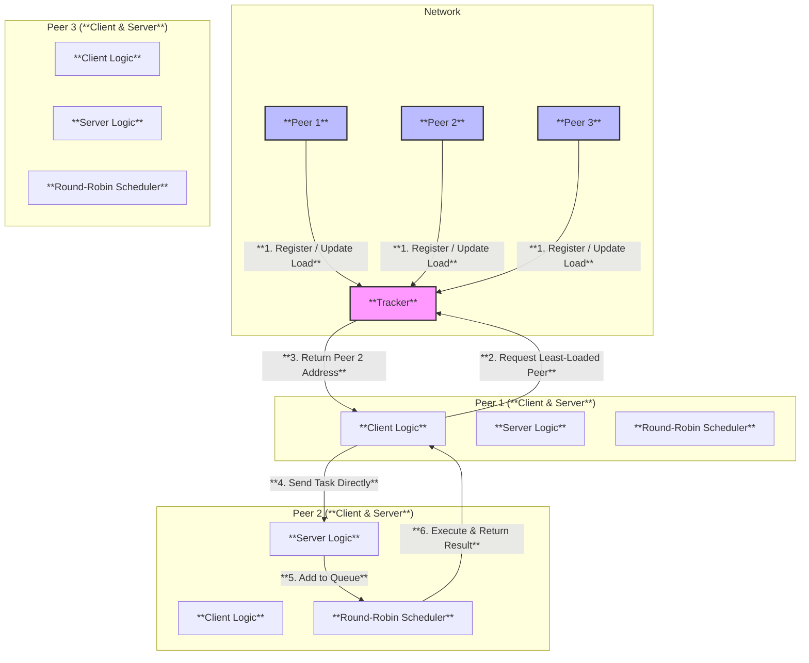
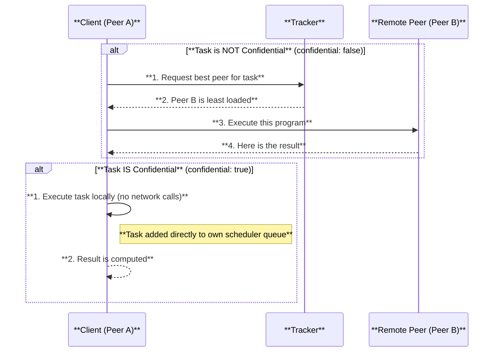

# P2P OS Resource Sharing System

A lightweight, peer-to-peer (P2P) distributed system in Python that simulates an operating system's ability to share CPU, memory, and disk resources across a network.


<!--  -->

---

## 🚀 Overview

This project implements a distributed resource-sharing system where peers cooperate to execute code, store data, and share files. A central tracker node facilitates peer discovery and performs basic load balancing, but all resource-sharing operations occur directly between peers.

It's designed as an academic project to demonstrate core concepts in distributed systems and operating systems, including socket programming, message-based communication, scheduling, and remote execution.

## ✨ Features

- **💻 Distributed CPU Execution**: Offload Python code execution to the least-loaded peer in the network.
- **🔒 Confidential Task Execution**: Mark tasks as "confidential" to ensure they only run on the local peer.
- **💾 Distributed Memory**: A simple key-value store shared across the network.
- **📂 Distributed File Storage**: Upload, store, and download files from remote peers.
- **🌐 Centralized Peer Discovery**: A tracker helps peers find each other and identifies the best peer for a job.
- **⚖️ Load Balancing**: The tracker directs tasks to peers with the lowest reported CPU load.
- **⚙️ Round-Robin Scheduling**: Each peer uses a fair, non-preemptive Round-Robin scheduler to process incoming tasks.
- **🖥️ Web UI**: Each peer can host an optional web interface to display its status and task history.

## 🏗️ System Architecture

The system consists of two main components: the **Tracker** and the **Peers**.



- **Tracker**: A central server that maintains a list of active peers and their current CPU load. It doesn't execute tasks itself but acts as a matchmaker.
- **Peer**: A node that acts as both a client and a server. It can submit its own tasks to the network and also accept and execute tasks from other peers. Each peer runs its own scheduler to manage its work queue.

## ⚙️ How to Run

Follow these steps to get the P2P system running on your local machine.

### 1. Prerequisites

- Python 3.7+
- `pip` for installing packages

### 2. Installation

Clone the repository and install the required dependencies.

```bash
git clone <your-repo-url>
cd p2p-os-term-project
pip install -r requirements.txt
```

### 3. Running the System

You can run the tracker and multiple peers manually or use the provided shell script.

#### Using the Script (Recommended)

The `start_multiple_peers.sh` script automates the process of starting the tracker and three peers, each with its own web UI.

```bash
# Make the script executable (if needed)
chmod +x start_multiple_peers.sh

# Run the script
./start_multiple_peers.sh
```

This will:
- Start the **Tracker**.
- Start **Peer 1** on port `9000` (Web UI on `5000`).
- Start **Peer 2** on port `9001` (Web UI on `5001`).
- Start **Peer 3** on port `9002` (Web UI on `5002`).

#### Running Manually

Open separate terminal windows for the tracker and each peer.

**Terminal 1: Start the Tracker**
```bash
python tracker.py
```

**Terminal 2: Start Peer 1**
```bash
python peer.py --port 9000 --web-port 5000
```

**Terminal 3: Start Peer 2**
```bash
python peer.py --port 9001 --web-port 5001
```

## 🛠️ How It Works

### CPU Task Workflow

This diagram illustrates the two paths for a CPU task, depending on the `confidential` flag.



### Communication Protocol

All communication between nodes is done via TCP sockets using JSON-formatted messages.

#### CPU Task Request
```json
{
  "type": "CPU_TASK",
  "task_id": "T123",
  "program": "def main(x): return x*x",
  "function": "main",
  "args": [5],
  "confidential": false
}
```

#### Memory Operations
```json
// Set a value
{
    "type": "SET_MEM",
    "key": "my_variable",
    "value": 12345
}

// Get a value
{
    "type": "GET_MEM",
    "key": "my_variable"
}
```

#### File Operations
```json
// Upload a file
{
    "type": "PUT_FILE",
    "filename": "document.txt",
    "data": "<base64_encoded_string>"
}

// Download a file
{
    "type": "GET_FILE",
    "filename": "document.txt"
}
```

##  CLI Client Examples

Use `client.py` to interact with any peer in the network.

#### Example 1: Remote CPU Execution
Execute a simple function on the least-loaded peer.
```bash
python client.py --port 9000 cpu --program "def main(a, b): return a + b" --args "[10, 32]"
```
> **Output:** `Result: 42`

#### Example 2: Confidential CPU Execution
Execute a task that is guaranteed to run locally on the connected peer (port 9000).
```bash
python client.py --port 9000 cpu --program "def main(s): return s.upper()" --args "['secret']" --confidential
```
> **Output:** `Result: SECRET`

#### Example 3: Set and Get a Memory Value
```bash
# Set a value on the peer at port 9000
python client.py --port 9000 set-mem --key "user:id" --value "101"

# Get the value back from the same peer
python client.py --port 9000 get-mem --key "user:id"
```
> **Output:** `Memory value: 101`

#### Example 4: Upload and Download a File
```bash
# Create a test file
echo "hello distributed world" > my_file.txt

# Upload the file to the peer at port 9001
python client.py --port 9001 put-file --filename "remote_copy.txt" --filepath "my_file.txt"

# Download it back from the same peer
python client.py --port 9001 get-file --filename "remote_copy.txt" --save "downloaded_copy.txt"
```

## 📂 Project Structure
```
/
├── tracker.py            # Central tracker server
├── peer.py               # Peer node (client/server logic)
├── client.py             # CLI client for interacting with the system
├── scheduler.py          # Round-robin scheduler for peers
├── executor.py           # Handles the `exec()` logic for CPU tasks
├── storage.py            # Manages disk/file storage for peers
├── web_ui.py             # Flask web interface for peers
├── messages.py           # Message creation and serialization
├── config.py             # System-wide configuration
├── requirements.txt      # Project dependencies
├── start_multiple_peers.sh # Script to launch the system
└── README.md             # This file
```

## ⚠️ Limitations

This is an academic project and intentionally simplifies or omits several production-grade features:
- **No Security/Sandboxing**: `exec()` is used to run remote code, which is highly insecure. This is a deliberate choice to focus on OS concepts over security engineering.
- **No Encryption**: All network traffic is plaintext.
- **No Authentication**: Any machine on the network can join and participate.
- **Simulated Scheduling**: The Round-Robin scheduler is non-preemptive.
- **No Distributed Consensus**: The tracker is a single point of failure.

## 🔮 Future Work

- **Sandboxed Execution**: Integrate a secure sandboxing mechanism like Docker containers or `py-sandbox` to safely execute remote code.
- **Distributed Hash Table (DHT)**: Replace the central tracker with a DHT (e.g., Kademlia) for decentralized peer discovery.
- **Fault Tolerance**: Implement mechanisms for peers to handle tracker or other peer failures gracefully.
- **Data Replication**: Replicate stored files and memory objects across multiple peers to prevent data loss.
- **Advanced Scheduling**: Implement more sophisticated scheduling algorithms (e.g., weighted round-robin, priority queues).
- **Security**: Add TLS encryption and peer authentication.
